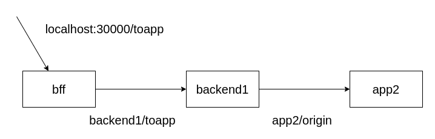

# Retry en Istio

La arquitectura propuesta para revisar este ejemplo consta de 3 microservicios, los cuales son:
- bff:
- backend1:
- app2:

La conexion entre las mismas esta dentalla en la siguiente imagen:



Primero es necesario crear el ambiente, para hacerlo todo mas facil vamos a ocupar el namespace default:

```plain
kubectl label namespace default istio-injection=enabled --overwrite
```{{exec}}

Ahora es necesario deployar las aplicaciones:
```plain
kubectl apply -f scenario/
```{{exec}}

Ahora es necesario exponer el servicio, y para ello vamos a hacer:
```plain
kubectl apply -f expose/
```{{exec}}

En este momento ya tenemos todo el servicio arriba y funcionando :D.

Para poder probar es necesario realizar un curl a localhost de la siguiente manera:

```plain
curl http://localhost:30000/toapp; echo;
```{{exec}}

Puede ejecutar varias veces el comando anterior viendo cual es el output que tenemos.

Si ejecutamos varias veces el comando, podemos ver los logs como cambian con el siguiente comando:

Para el bff:
```plain
kubectl logs -l app=bff
```{{exec}}

Para el backend1:
```plain
kubectl logs -l app=backend1
```{{exec}}

Para el app2:
```plain
kubectl logs -l app=app2
```{{exec}}


Ahora vamos a pasar al siguiente paso donde hacemos algo mas divertido... Agregamos 503 a las apps para probar los retries....
