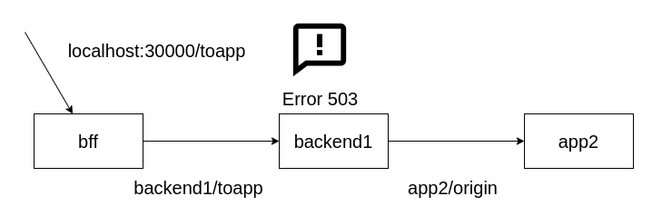

# Segundo escenario

En este ultimo caso vamos a poner el error en la app2, y veremos que es lo que pasa.

El diagrama que tendremos es asi:



Asi que primero lo que vamos a hacer es que el backend1 devuelva 200 siempre:
```plain
kubectl set env deployment/backend1 STATUS_CODE_APP=200
```{{exec}}

Ahora le decimos a la app2 que devuelva 503, en este caso tendremos:
```plain
kubectl set env deployment/app2 STATUS_CODE_APP=503
```{{exec}}

Por ultimo limpiamos el log del bff para poder trabajar sin ruido:
```plain
kubectl rollout restart deployment bff
```{{exec}}

Esperamos hasta que todos los pods esten en estado Running.
```plain
kubectl get pod
```{{exec}}

Entonces ahora si probamos una llamada a nuestro endpoint tendremos:
```plain
curl http://localhost:30000/toapp; echo;
```{{exec}}

## Miremos los logs

Para ver los logs hacemos:
Para el bff:
```plain
kubectl logs -l app=bff
```{{exec}}

Para el backend1:
```plain
kubectl logs -l app=backend1
```{{exec}}

Para el app2:
```plain
kubectl logs -l app=app2
```{{exec}}

## Que es lo que se ve?

Lo que vemos es que:
- log de bff: Solo hay una llamada.
- log de backend1: Solo hay una llamada.
- log de app2: Tiene 3 llamadas a diferentes pods.

## Que paso?

Paso exactamente lo mismo que en el caso anterior, el envoy del backend1 detecto que habia un problema con la conexion con la app2 (dado a que recibio 503), por lo tanto, fue marcando cada uno de los pod que le devolvieron un error y realizo 3 llamadas totales (1 es la original mas 2 retries)

## Que otro escenario existe?

Con estas pruebas usted puede realizar los siguientes escenarios:
- que solo el bff devuelva error.
- que tanto el backend1 como la app2 devuelvan errores.
- Que todos los artefactos devuelvan errores.


## Que nos queda a continuacion?

probar las configuraciones de virtual service para modificar el comportamiento de istio retries.


